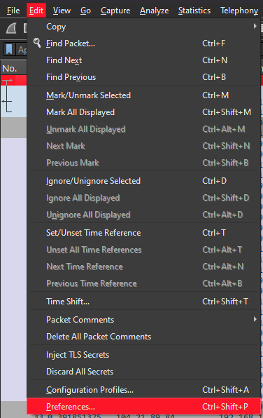
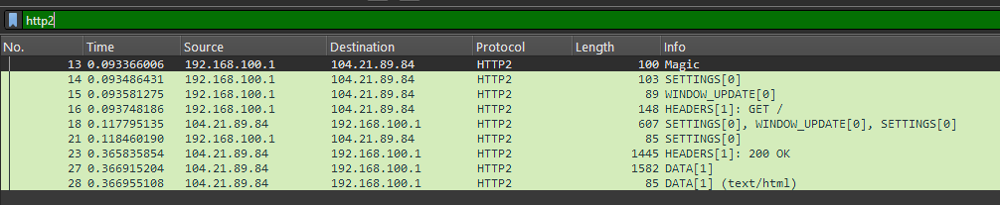

Open nw-intro09.pcapng

Download the keys file

Open Wireshark and se the TLS keys

Edit -> Preferences 

Under Protocols find TLS and browse for the keys file in the "(PRE) Master Secret log filename" option

Once submitted, HTTP2 frames will be readable

Filter for http2

Right click the first frame, Follow -> HTTP2 Stream and get the flag