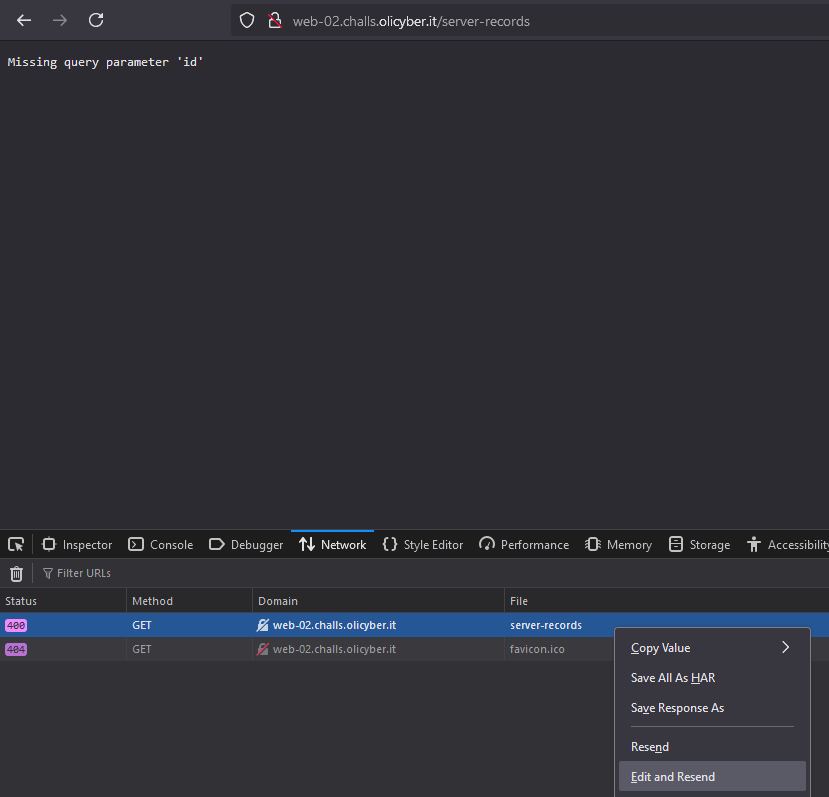
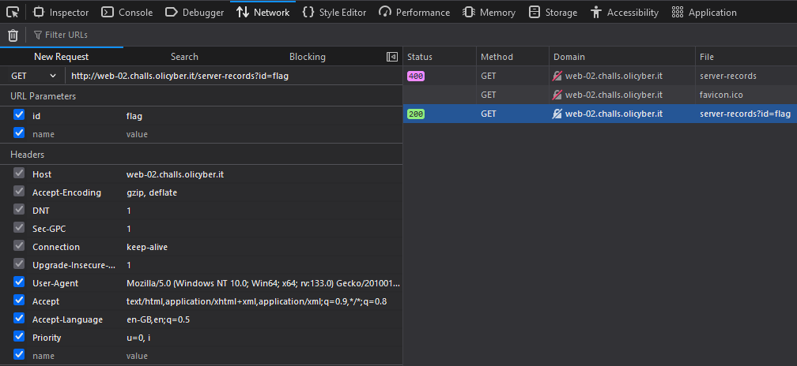
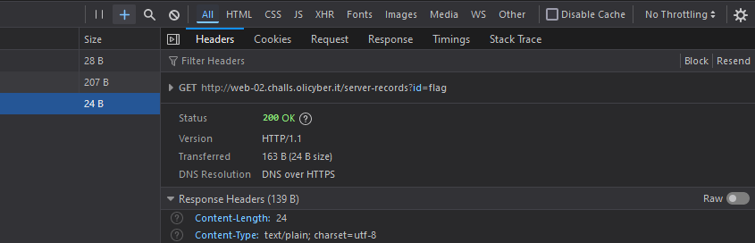

Open http://web-02.challs.olicyber.it/server-records

As before we must send a GET request, this time we have to send also the query string ?id=flag

Right click anywhere in the website, go to the DevTools by choosing Inspect

Go to the Network tab and reload the website, two GET requests will be logged, the one we need is the server-records one

Right click the GET request and choose Edit and resend 

In the URL Parameters section set a new parameter with name "id" and value "flag"

Once you get the 200 status code use the panel on the right to see the response in the Response tab

